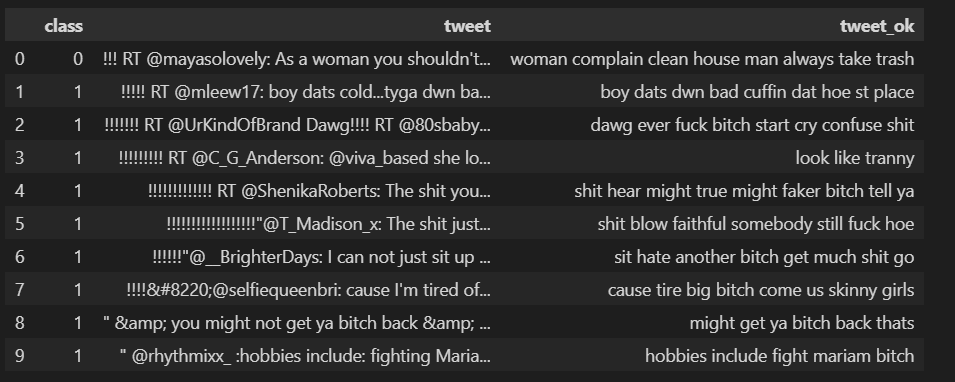
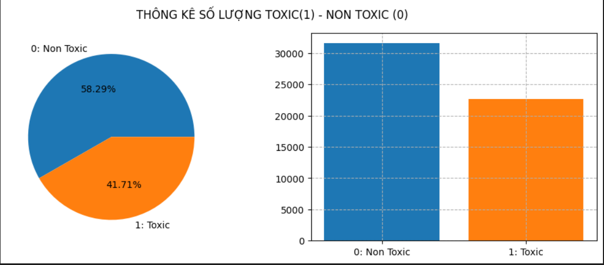
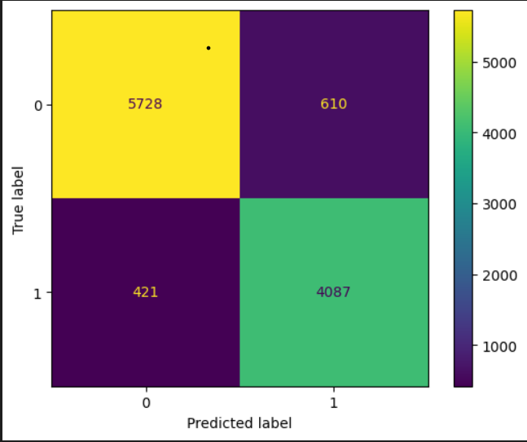

# Phân loại Comment Độc hại (Toxic) và Không độc hại (Non-Toxic) sử dụng Naive Bayes

## Mục tiêu
Dự án này tập trung vào việc xây dựng một mô hình máy học để tự động phân loại các bình luận (comment) thành hai loại:
- **0: Non-Toxic** - Không độc hại
- **1: Toxic** - Độc hại

Sử dụng thuật toán **Naive Bayes** kết hợp với các kỹ thuật xử lý ngôn ngữ tự nhiên (NLP).

### Xử lý Ngôn ngữ Tự nhiên (NLP)
- **Tiền xử lý văn bản**: Làm sạch dữ liệu, chuẩn hóa từ
- **Trích chọn đặc trưng**: Chuyển đổi văn bản thành dạng số
- **Phân loại văn bản**: Sử dụng thuật toán học máy

### Các kỹ thuật NLP được áp dụng:

#### 1. **Làm sạch dữ liệu**
- Chuyển về chữ thường
- Xử lý từ viết tắt (he's → he is)
- Loại bỏ liên kết, email, ký tự đặc biệt
- Chỉ giữ lại ký tự chữ cái

#### 2. **Loại bỏ stopwords**
Sử dụng danh sách stopwords tiếng Anh từ NLTK

#### 3. **Chuẩn hóa từ**
- **Stemming**: Rút gọn từ về dạng gốc
- **Lemmatization**: Chuẩn hóa từ về dạng từ điển

### Thuật toán Máy học
- **Naive Bayes**: Thuật toán phân loại dựa trên định lý Bayes, đặc biệt hiệu quả với dữ liệu văn bản

## Bộ dữ liệu

### Thông tin chung:
- **Tổng số comment**: 56,700 bình luận ban đầu
- **Sau khi xử lý**: 54,228 bình luận (sau khi loại bỏ trùng lặp và rỗng)

### Đặc trưng:
| Tên cột | Mô tả |
|---------|-------|
| `class` | Nhãn phân loại (0: Non-Toxic, 1: Toxic) |
| `tweet` | Nội dung comment gốc |
| `tweet_ok` | Nội dung comment sau khi xử lý |

### Phân phối dữ liệu:

| Loại | Số lượng | Tỷ lệ |
|------|----------|--------|
| **Non-Toxic (0)** | 31,609 mẫu | 58.27% |
| **Toxic (1)** | 22,619 mẫu | 41.73% |

### độ chính xác mô hình

Nhãn thực tế \ Dự đoán | Class 0 | Class 1
------------------------|---------|--------
**Class 0**             | 5728    | 610
**Class 1**             | 421     | 4087

Accuracy = (5728 + 4087) / 10846 = 9815 / 10846 ≈ 0.905 = 90.5%